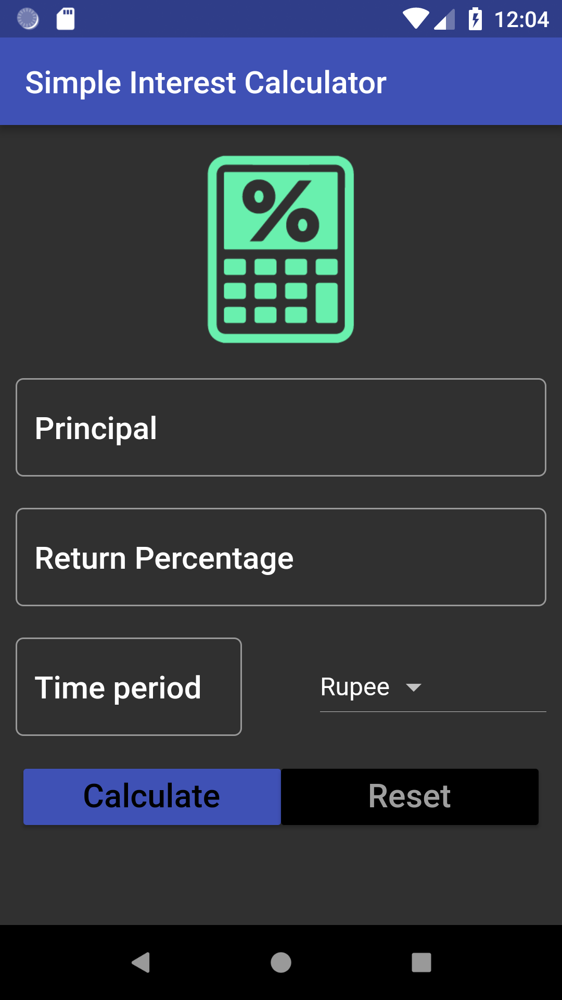

# FlutterDevelopment
Learning Flutter - The Complete Flutter development course for iOS and Android by Smartherd developers on Udemy

### Contents:

1. Calculator_SI - A simple interest calculator

Short App demo -

